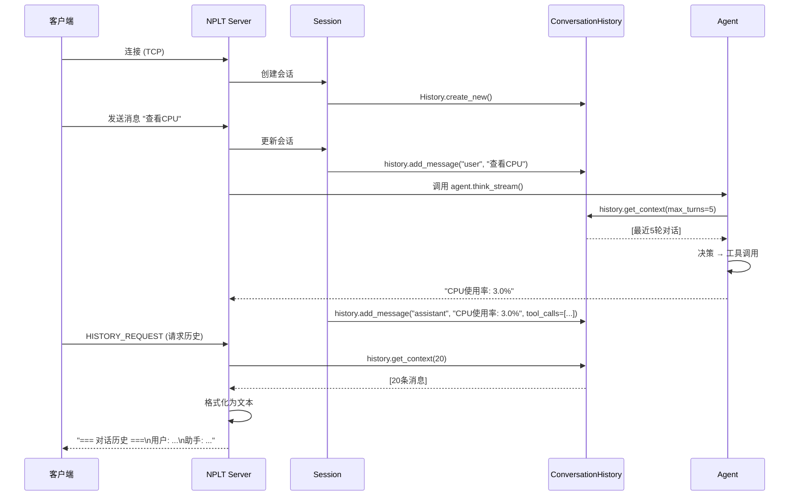

# 历史记录实现机制详解

**创建时间**: 2025-12-31
**目的**: 全面说明当前系统的历史记录存储、传输和使用机制

---

## 目录

1. [架构概览](#架构概览)
2. [数据结构](#数据结构)
3. [存储机制](#存储机制)
4. [会话管理](#会话管理)
5. [传输机制](#传输机制)
6. [使用流程](#使用流程)

---

## 架构概览

```
┌─────────────────────────────────────────────────────┐
│                    Server                         │
├─────────────────────────────────────────────────────┤
│                                                       │
│  ┌──────────────┐        ┌──────────────────┐     │
│  │   Session    │───────>│ConversationHistory│     │
│  │ (TCP连接)    │        │  (内存+磁盘)     │     │
│  └──────────────┘        └──────────────────┘     │
│         │                           │                │
│         │ 1. 接收消息                │ 2. 保存到磁盘   │
│         │                          │ (JSON格式)      │
│         │ 3. 传递给Agent             │                │
│         ↓                          │                │
│  ┌──────────────┐                  │                │
│  │    Agent     │<─────────────────┘                │
│  │              │                                   │
│  │ think()      │──> get_context(max_turns=5)     │
│  │              │                                   │
│  └──────────────┘                                   │
│                                                       │
└─────────────────────────────────────────────────────┘
         │
         │ NPLT 协议 (TCP)
         │
┌────────▼────────┐
│   Client         │
│                  │
│ 请求历史:        │
│ HISTORY_REQUEST │
│                  │
│ 接收历史:        │
│ 文本格式         │
└──────────────────┘
```

---

## 数据结构

### 1. ConversationHistory（对话历史）

**位置**: [src/storage/history.py](../src/storage/history.py)

```python
@dataclass
class ConversationHistory:
    """对话历史"""
    session_id: str               # 会话 ID
    messages: List[ChatMessage]   # 消息列表
    created_at: datetime          # 创建时间
    updated_at: datetime          # 更新时间
```

**特点**:
- ✅ 内存中维护完整对话历史
- ✅ 支持序列化到 JSON 文件
- ✅ 支持从 JSON 文件加载
- ✅ 提供上下文查询接口

### 2. ChatMessage（聊天消息）

```python
@dataclass
class ChatMessage:
    """聊天消息"""
    role: Literal["user", "assistant", "system"]  # 角色
    content: str                      # 消息内容
    timestamp: datetime                # 时间戳
    tool_calls: List[ToolCall] = field(default_factory=list)  # 工具调用
    metadata: dict = field(default_factory=dict)              # 元数据
```

**数据字段**:
- `role`: 消息角色（用户/助手/系统）
- `content`: 消息文本内容
- `timestamp`: 消息时间戳
- `tool_calls`: 工具调用列表（如果有的话）
- `metadata`: 其他元数据

### 3. ToolCall（工具调用）

```python
@dataclass
class ToolCall:
    """工具调用"""
    tool_name: str          # 工具名称
    arguments: dict         # 工具参数
    result: str             # 执行结果
    status: str             # 执行状态
    duration: float         # 执行时长（秒）
    timestamp: datetime     # 调用时间
```

---

## 存储机制

### 1. 内存存储（运行时）

```python
# Session 对象中维护
class Session:
    conversation_history: ConversationHistory = None

# 创建会话时初始化
session.conversation_history = ConversationHistory.create_new(session_id)
```

**特点**:
- ✅ 快速访问（内存操作）
- ✅ 实时更新（每次对话后添加消息）
- ⚠️ 断开连接后数据丢失（如果不持久化）

### 2. 磁盘存储（持久化）

**文件位置**: `storage/history/session_YYYYMMDD_<session_id>.json`

**格式**: JSON

```json
{
  "session_id": "abc123-def456-...",
  "messages": [
    {
      "role": "user",
      "content": "帮我查看CPU使用率",
      "timestamp": "2025-12-31T10:00:00",
      "tool_calls": [],
      "metadata": {}
    },
    {
      "role": "assistant",
      "content": "让我查看一下系统资源使用情况",
      "timestamp": "2025-12-31T10:00:01",
      "tool_calls": [
        {
          "tool_name": "sys_monitor",
          "arguments": {"metric": "cpu"},
          "result": "CPU 使用率: 3.0%",
          "status": "success",
          "duration": 0.5,
          "timestamp": "2025-12-31T10:00:02"
        }
      ],
      "metadata": {}
    }
  ],
  "created_at": "2025-12-31T10:00:00",
  "updated_at": "2025-12-31T10:05:00"
}
```

**保存时机**:
- 每次对话结束后（应该在 `_handle_chat` 中调用）
- 会话切换时
- 定期自动保存（可配置）

**加载时机**:
- 会话切换时（从磁盘加载历史）
- 服务器重启后恢复会话

---

## 会话管理

### 1. 会话创建

```python
# src/server/nplt_server.py:215-226

# 创建会话
session_id = str(uuid.uuid4())
session = Session(
    session_id=session_id,
    client_addr=addr,
    connected_at=datetime.now(),
    # ...
    conversation_history = ConversationHistory.create_new(session_id)  # ← 创建空历史
)
```

### 2. 多会话支持

**SessionManager**: 管理多个会话

```python
class SessionManager:
    sessions: Dict[str, Session]  # session_id -> Session

    def create_session(self) -> Session:
        """创建新会话"""

    def switch_session(self, session_id: str) -> bool:
        """切换会话"""

    def get_session(self, session_id: str) -> Optional[Session]:
        """获取会话"""
```

### 3. 会话切换流程

```python
# src/server/nplt_server.py:715-738

async def _handle_session_switch(self, session: Session, message: NPLTMessage):
    """处理会话切换请求"""
    target_session_id = data.get("session_id")

    # 1. 切换会话管理器中的当前会话
    success = self.session_manager.switch_session(target_session_id)

    # 2. 加载目标会话的历史记录
    new_history = ConversationHistory.load(target_session_id)
    if new_history:
        session.conversation_history = new_history  # ← 加载历史
    else:
        # 如果加载失败，创建新的历史记录
        session.conversation_history = ConversationHistory.create_new(target_session_id)

    # 3. 发送确认
    await session.send_message(
        MessageType.CHAT_TEXT,
        f"已切换到会话: {session_name}".encode('utf-8')
    )
```

---

## 传输机制

### 1. 历史记录请求

**客户端发送**:
```python
# NPLT 消息
MessageType.HISTORY_REQUEST = 0x10

await client.send_message(
    MessageType.HISTORY_REQUEST,
    b""  # 空数据，或者指定数量
)
```

**服务器处理**:
```python
# src/server/nplt_server.py:594-626

async def _handle_history_request(self, session: Session, message: NPLTMessage):
    """处理历史记录请求"""

    # 1. 检查是否有历史记录
    if not session.conversation_history:
        await session.send_message(
            MessageType.CHAT_TEXT,
            "暂无对话历史".encode('utf-8')
        )
        return

    # 2. 获取历史记录（最近 20 条）
    messages = session.conversation_history.get_context(num_messages=20)

    # 3. 格式化历史记录（❌ 当前是文本格式）
    history_text = "\n\n=== 对话历史 ===\n\n"
    for msg in messages:
        role = "用户" if msg["role"] == "user" else "助手"
        history_text += f"{role}: {msg['content']}\n\n"

    # 4. 发送历史记录（NPLT CHAT_TEXT 类型）
    await session.send_message(
        MessageType.CHAT_TEXT,
        history_text.encode('utf-8')
    )
```

### 2. 当前传输格式

**类型**: `MessageType.CHAT_TEXT` (0x01)

**格式**: 纯文本

```
=== 对话历史 ===

用户: 帮我查看CPU使用率

助手: 让我查看一下系统资源使用情况

助手: CPU 使用率: 3.0%
```

**问题**:
- ❌ 丢失了 `tool_calls`（工具调用详情）
- ❌ 丢失了 `timestamp`（时间戳）
- ❌ 丢失了 `metadata`（元数据）
- ❌ 客户端无法解析或二次处理

---

## 使用流程

### 完整对话流程



### 数据流

```
1. 用户发送消息
   Client → NPLT → Session.conversation_history.add_message(user, "...")

2. Agent 处理
   Agent → ConversationHistory.get_context() → 返回最近 N 轮

3. Agent 返回结果
   Agent → Session.conversation_history.add_message(assistant, "...", tool_calls=[...])

4. 持久化
   ConversationHistory.save() → storage/history/session_*.json

5. 客户端请求历史
   Client → NPLT: HISTORY_REQUEST
   NPLT → ConversationHistory.get_context()
   NPLT → Client: 格式化后的文本
```

---

## 当前机制总结

### ✅ 优点

1. **服务器端存储** - Agent 可直接访问上下文
2. **完整数据结构** - JSON 保存所有字段（tool_calls, metadata 等）
3. **会话隔离** - 每个会话独立历史
4. **多会话支持** - 可切换不同会话
5. **持久化** - 磁盘存储，重启不丢失

### ⚠️ 需要改进

1. **传输格式** - 当前文本格式丢失结构化信息
2. **保存时机** - 需要确保每次对话后都保存
3. **历史记录查询** - 当前只返回固定数量，应该支持分页

### 推荐改进

**改进历史记录传输**（不改存储架构）:

```python
async def _handle_history_request(self, session: Session, message: NPLTMessage):
    """处理历史记录请求（改进版）"""

    # 获取历史记录
    messages = session.conversation_history.get_context(num_messages=20)

    # ✅ 使用 JSON 格式保留完整结构
    history_data = {
        "session_id": session.session_id,
        "message_count": len(session.conversation_history.messages),
        "messages": [
            {
                "role": msg.role,
                "content": msg.content,
                "timestamp": msg.timestamp.isoformat(),
                "tool_calls": [tc.to_dict() for tc in msg.tool_calls],  # ✅ 保留工具调用
                "metadata": msg.metadata  # ✅ 保留元数据
            }
            for msg in messages
        ]
    }

    # 发送 JSON 数据（仍然可以使用 CHAT_TEXT 类型，但内容是 JSON）
    await session.send_message(
        MessageType.CHAT_TEXT,
        json.dumps(history_data, ensure_ascii=False).encode('utf-8')
    )
```

---

**文档版本**: v1.0
**最后更新**: 2025-12-31
**作者**: Claude Sonnet 4.5
