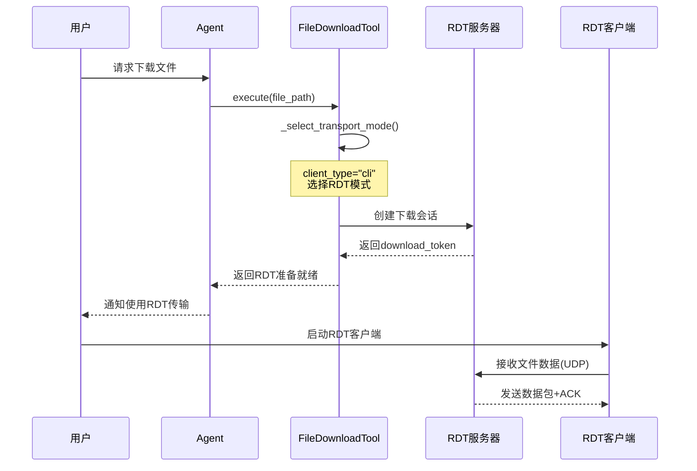
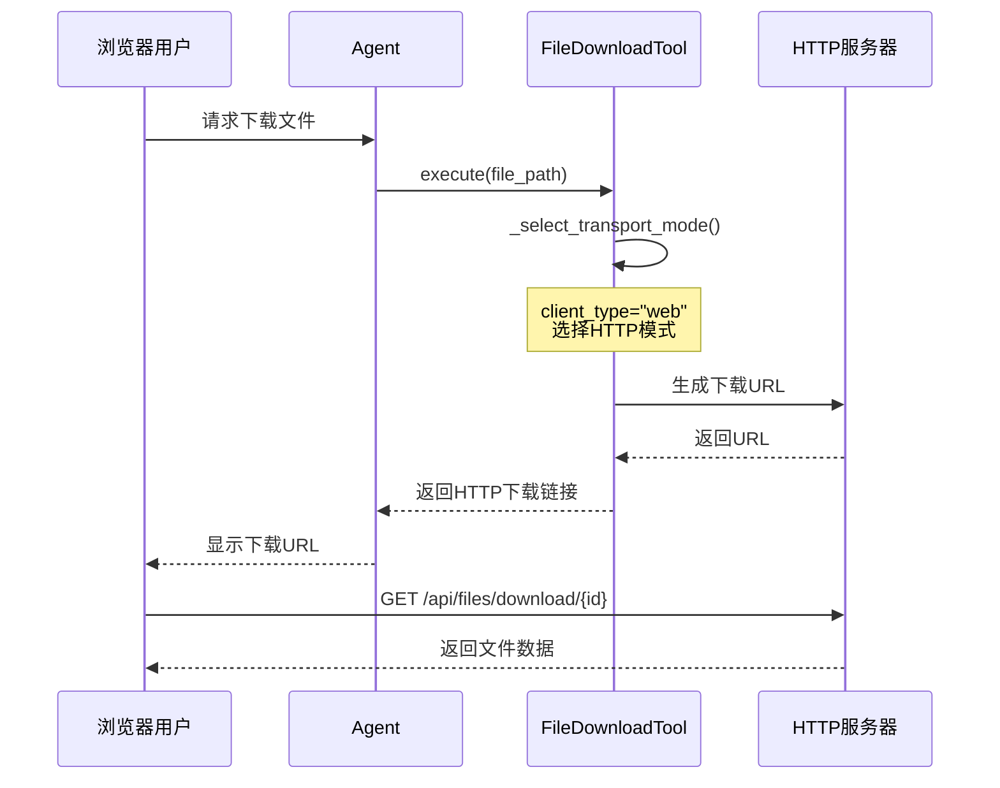

# 混合传输架构实现文档（方案A）

**创建时间**: 2025-12-31
**目标**: 在满足RDT协议设计要求的同时，支持多客户端（CLI/Web/Desktop）

---

## 📋 架构概览

### 双层协议架构

```
┌─────────────────────────────────────────┐
│         Agent 工具调度层                 │
│  智能选择传输方式（基于client_type）      │
└─────────────────────────────────────────┘
                  ↓
    ┌─────────────┼─────────────┐
    ↓             ↓             ↓
┌─────────┐  ┌─────────┐  ┌─────────┐
│   RDT   │  │  HTTP   │  │  NPLT   │
│  UDP    │  │ Web API │  │  TCP    │
│(CLI优先)│  │(Web优先)│  │(兼容)   │
└─────────┘  └─────────┘  └─────────┘
```

---

## 🎯 核心特性

### 1. 多协议文件传输支持

#### RDT协议（UDP可靠传输）
- **用途**: CLI客户端的高速文件传输
- **特性**:
  - 基于UDP的滑动窗口协议
  - 超时重传机制
  - CRC16校验和验证
  - 累积ACK确认
- **文件**: [src/protocols/rdt.py](../src/protocols/rdt.py)
- **端口**: 9998 (UDP)

#### HTTP文件服务器
- **用途**: Web客户端的文件下载
- **特性**:
  - RESTful API设计
  - 支持CORS跨域
  - 文件流式传输
  - Content-Disposition头触发浏览器下载
- **文件**: [src/server/http_server.py](../src/server/http_server.py)
- **端口**: 8080 (HTTP)
- **接口**: `GET /api/files/download/{file_id}`

#### NPLT协议（TCP兼容）
- **用途**: 降级方案，确保兼容性
- **特性**:
  - 基于TCP的可靠传输
  - 应用层二进制协议
  - 流式数据传输
- **文件**: [src/protocols/nplt.py](../src/protocols/nplt.py)
- **端口**: 9999 (TCP)

### 2. 智能传输选择

Agent根据客户端类型自动选择最优传输方式：

| 客户端类型 | 优先协议 | 降级方案 |
| :--- | :--- | :--- |
| **CLI** | RDT (UDP) | NPLT (TCP) |
| **Web** | HTTP | NPLT (TCP) |
| **Desktop** | RDT (UDP) | HTTP/NPLT (TCP) |

### 3. 客户端类型识别

Session支持`client_type`字段，支持三种类型：
- `cli`: 命令行客户端（默认）
- `web`: 浏览器客户端
- `desktop`: 桌面客户端（Electron/Tauri）

---

## 📁 实现细节

### 文件修改清单

#### 1. src/tools/file_download.py
**修改内容**: 添加多协议传输支持

**关键方法**:
```python
def _select_transport_mode(self) -> str:
    """智能选择传输模式"""
    if self.client_type == "web":
        return "http" if self.http_base_url else "nplt"
    elif self.client_type == "cli":
        return "rdt" if self.rdt_server else "nplt"
    return "nplt"

def _execute_download(...) -> dict:
    """执行下载（路由到具体传输方法）"""
    if transport_mode == "rdt":
        return self._download_via_rdt(...)
    elif transport_mode == "http":
        return self._download_via_http(...)
    elif transport_mode == "nplt":
        return self._download_via_nplt(...)
```

**新增字段**:
- `rdt_server`: RDT服务器实例
- `http_base_url`: HTTP下载基础URL
- `client_type`: 客户端类型（cli/web/mobile）

#### 2. src/server/agent.py
**修改内容**: 集成RDT服务器

**关键代码**:
```python
@dataclass
class ReActAgent:
    rdt_server: Optional[Any] = None
    http_base_url: Optional[str] = None

    def __post_init__(self):
        # 初始化RDT服务器
        if self.rdt_server is None:
            self.rdt_server = RDTServer(
                host="0.0.0.0",
                port=9998,
                window_size=5,
                timeout=0.1
            )

        # 创建file_download工具时传入RDT服务器
        self.tools["file_download"] = FileDownloadTool(
            path_validator=self.path_validator,
            rdt_server=self.rdt_server,
            http_base_url=self.http_base_url,
            client_type="cli"
        )
```

#### 3. src/server/http_server.py
**修改内容**: 新建HTTP文件服务器

**关键类**:
```python
class HTTPFileServer:
    """HTTP文件服务器"""

    async def start(self):
        """启动HTTP服务器"""
        self.app = web.Application()
        self.app.router.add_get(
            '/api/files/download/{file_id}',
            self.handle_download
        )

    async def handle_download(self, request):
        """处理文件下载请求"""
        file_id = request.match_info['file_id']
        file_path = self.storage_dir / file_id
        return web.FileResponse(actual_file)
```

**特性**:
- 支持CORS跨域请求
- 自动设置Content-Disposition头
- 错误处理和日志记录

#### 4. src/server/nplt_server.py
**修改内容**: 添加client_type字段

**关键代码**:
```python
@dataclass
class Session:
    # ... 其他字段 ...
    client_type: str = "cli"  # 客户端类型：cli | web | desktop
```

#### 5. src/server/main.py
**修改内容**: 动态更新file_download工具的client_type

**关键代码**:
```python
async def _handle_chat(self, session: Session, message: str):
    # 动态更新file_download工具的client_type
    if "file_download" in self.agent.tools:
        self.agent.tools["file_download"].client_type = session.client_type
```

---

## 🔄 工作流程

### CLI客户端文件下载流程



### Web客户端文件下载流程



---

## 🧪 测试验证

### 导入测试
```bash
PYTHONPATH=/home/zhoutianyu/tmp/LLMChatAssistant python3 -c "
from src.server.http_server import HTTPFileServer
from src.tools.file_download import FileDownloadTool
from src.server.agent import ReActAgent
from src.server.rdt_server import RDTServer
print('✓ 所有模块导入成功')
"
```

### 功能测试（TODO）
- [ ] CLI客户端RDT文件传输测试
- [ ] Web客户端HTTP下载测试
- [ ] 多协议切换测试
- [ ] 并发文件传输测试
- [ ] 错误处理测试

---

## 📊 架构优势

### ✅ 优点

1. **满足大作业要求**: 完整实现RDT协议设计（滑动窗口、超时重传、UDP传输）
2. **多客户端支持**: CLI/Web/Desktop都能得到最优传输方案
3. **性能优化**: CLI和Desktop客户端使用UDP高速传输，Web客户端使用原生HTTP
4. **兼容性保证**: NPLT作为降级方案确保所有场景可用
5. **可扩展性**: 易于添加新的传输协议或客户端类型
6. **实现成本可控**: 无需WebRTC等复杂技术

### ⚠️ 注意事项

1. **RDT协议使用UDP**: 需要注意防火墙和NAT穿透问题
2. **HTTP服务器独立运行**: 需要在main.py中启动HTTP服务器（当前未集成）
3. **客户端类型标识**: 需要客户端主动标识自己的类型（或由服务器识别）

---

## 🚀 后续工作

### 立即需要
1. **集成HTTP服务器到main.py**: 在Server.start()中启动HTTP服务器
2. **编写RDT文件传输测试**: 验证端到端文件传输流程
3. **更新客户端**: 支持client_type标识和RDT下载

### 可选增强
1. **WebSocket支持**: 为Web客户端提供实时文件传输进度
2. **断点续传**: 支持大文件的分块传输和断点续传
3. **加密传输**: 添加TLS/SSL支持
4. **带宽自适应**: 根据网络状况动态调整传输策略

---

## 📝 参考资料

- [RDT协议规范](../src/protocols/rdt.py)
- [NPLT协议规范](../src/protocols/nplt.py)
- [文件工具接口文档](../specs/003-file-tools-integration/contracts/file-tools-interface.md)
- [混合架构设计决策](../specs/003-file-tools-integration/research.md)

---

**文档版本**: v1.0
**最后更新**: 2025-12-31
**作者**: Claude + 人类协作
