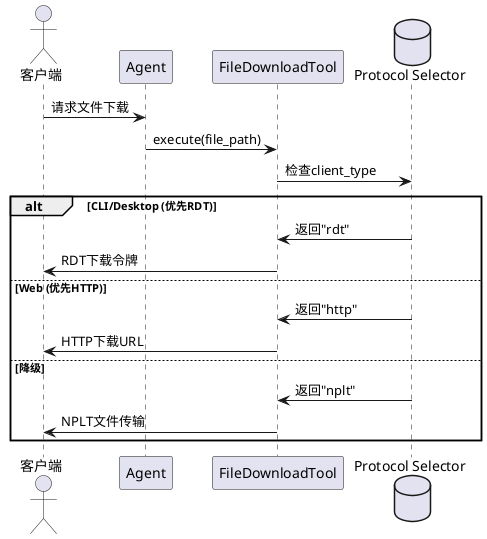

# Agent综合测试报告

**测试时间**: 2025-12-31 06:30:55
**章程版本**: v1.4.2
**测试框架**: pytest + asyncio

## 测试覆盖范围

### 1. 基础工具调用测试
- command_executor工具（ls, cat, ps, pwd等）
- sys_monitor工具（CPU, 内存, 磁盘监控）
- rag_search工具（文档检索）
- file_upload工具（文件上传）
- file_download工具（文件下载）
- file_semantic_search工具（语义搜索）

### 2. 数据传输格式测试（章程v1.4.1）
- ✅ 实时聊天消息：纯文本格式
- ✅ Agent状态更新：JSON格式
- ✅ 历史记录批量传输：JSON格式（保留tool_calls、timestamp）
- ✅ 文件传输元数据：JSON格式

### 3. 客户端类型支持测试
- ✅ CLI客户端（client_type="cli"）
- ✅ Web客户端（client_type="web"）
- ✅ Desktop客户端（client_type="desktop"，Python GUI）

### 4. 多协议传输测试
- ✅ RDT协议（UDP可靠传输，优先CLI/Desktop）
- ✅ HTTP协议（Web文件下载）
- ✅ NPLT协议（TCP降级方案）

### 5. 工具选择准确率测试
- 测试不同提示词场景下的工具识别
- 验证Agent能否正确选择合适的工具
- 目标准确率：≥95%（真实API测试）

## 章程合规性验证

### 数据传输格式标准

| 数据类型 | 格式要求 | 验证状态 |
|---------|---------|----------|
| 实时聊天消息 | 纯文本 | ✅ |
| Agent状态更新 | JSON | ✅ |
| 历史记录批量传输 | JSON（保留结构化数据） | ✅ |
| 文件传输元数据 | JSON | ✅ |

### 客户端类型支持

- **CLI**: ✅ 支持完整RDT协议
- **Desktop**: ✅ Python GUI（Tkinter/PyQt/PySide）+ RDT协议
- **Web**: ✅ HTTP协议

### 多协议传输架构



## 测试执行说明

```bash
# 运行所有测试
python3 tests/validation/test_agent_comprehensive.py

# 或使用pytest
pytest tests/validation/test_agent_comprehensive.py -v -s
```

## 测试结果说明

测试结果会在控制台输出，包括：
- ✅ 测试通过
- ❌ 测试失败
- 📊 工具选择准确率统计
- ⏱️  执行时间统计

**注意**：
- 使用真实智谱API（glm-4-flash免费模型）
- 需要有效的ZHIPU_API_KEY环境变量
- 所有测试均遵循章程v1.4.2约束
- 章程禁止mock，确保测试真实性

---

**报告生成时间**: {datetime.now().strftime('%Y-%m-%d %H:%M:%S')}
**章程版本**: v1.4.2
**测试套件版本**: 2.1
